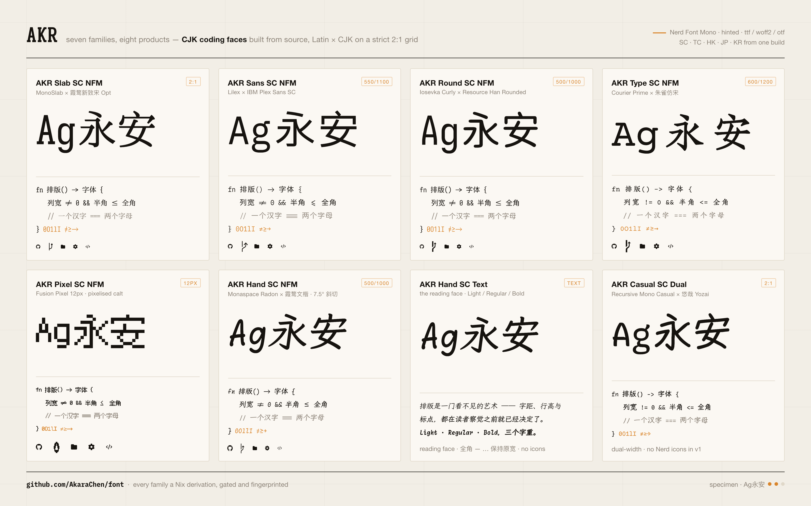

<div align="center">



# font

**Seven CJK coding fonts, built from source, reproducibly.**

Latin designs married to CJK masters on a strict 2:1 grid, patched with Nerd
Font icons, hinted, gated and fingerprinted — every family is a Nix derivation,
and a release is built by the same command you run locally.

[](LICENSE)
[](docs/build-toolchain.md)
[](flake.nix)
[](https://github.com/AkaraChen/font/releases)

<sub>The specimen above is rendered from the released `.ttf`s themselves — source: [`docs/assets/specimen.html`](docs/assets/specimen.html).</sub>

</div>

---

## The families

Every product is named **`AKR <Style> <Region> <Variant> [<Weight>]`**.

| family | Latin | CJK | dual width | weights |
| --- | --- | --- | --- | --- |
| **`AKR Slab SC NFM`** · [`serif/`](serif) | MonoSlab | 霞鹜新致宋 Opt | 2:1 | Regular · Bold |
| **`AKR Sans SC NFM`** · [`sans/`](sans) | Lilex | IBM Plex Sans SC | 550 / 1100 | Regular · Bold |
| **`AKR Round SC NFM`** · [`rounded/`](rounded) | Iosevka Curly | Resource Han Rounded | 500 / 1000 | Regular · Bold |
| **`AKR Type SC NFM`** · [`typewriter/`](typewriter) | Courier Prime | 朱雀仿宋 Zhuque | 600 / 1200 | Regular · Bold |
| **`AKR Pixel SC NFM`** · [`pixel/`](pixel) | Fusion Pixel 12px | Fusion Pixel 12px | 2:1 | Regular |
| **`AKR Hand SC NFM`** · [`handwriting/`](handwriting) | Monaspace Radon | 霞鹜文楷 LXGW | 500 / 1000 | Regular · Bold |
| **`AKR Hand SC Text`** · [`handwriting/`](handwriting) | Monaspace Radon | 霞鹜文楷 LXGW | reading face | Light · Regular · Bold |
| **`AKR Casual SC Dual`** · [`casual/`](casual) | Recursive Mono Casual | Yozai 悠哉 | 2:1 | Regular · Bold |

`<Region>` is a build axis, not a separate recipe: `SC` `TC` `HK` `JP` `KR` come
out of one Latin build and several CJK masters. `<Variant>` is `NFM` (Nerd Font
Mono coding face), `Text` (reading face) or `Dual` (dual-width coding face with
no icons).

Some of the things a family does are measured rather than guessed —
handwriting shears its CJK **7.5°** to match Radon's lean and pairs Light with
WenKai *Regular*, typewriter emboldens Zhuque by stem width, pixel pixelizes the
`calt` ligatures but not the Nerd icons.

## Build one

The toolchain is pinned by a Nix flake; `just` is a thin alias layer over it.
Nothing to install first, no per-family build script to run by hand.

```bash
just dev                     # the pinned shell: fontforge, ttfautohint, afdko, node, python
just build sans              # → sans/out/nerd/AKRSansSCNFM-{Regular,Bold}.{ttf,woff2}
just build sans coding tc    # one matrix cell
just matrix                  # every (family, profile, region) cell there is
just --list                  # everything else
```

And the checks that stand between a build and a release:

```bash
just gate sans               # the family's 2:1 / EAW / Nerd / OT-feature gate
just verify sans             # diff the products against the committed fingerprint baseline
just release sans coding sc  # the release zip (depends on the gate)
just notes sans coding sc    # the release notes that zip ships with
```

## Formats

The `.ttf` is the product. The others are derived from it and are not
interchangeable with it:

| format | what it is | who wants it |
| --- | --- | --- |
| `.ttf` | TrueType outlines, hinting intact | everyone — editors, terminals, desktop |
| `.woff2` | the **same outlines**, Brotli-compressed. Byte-identical `glyf` data, gated as such on every build | `@font-face` on the web |
| `.otf` | PostScript/CFF, converted with qu2cu: curves refit within 1 font unit, **hinting dropped**, contours reversed | print / design tools that want CFF |

Which cells ship which is `[[build.matrix]]` in each `font.toml`; `just matrix`
prints it. The defaults are `coding = ttf + woff2` and `text = ttf + woff2 +
otf` — a coding face is hinted and lives in an editor, so an unhinted CFF
version of it would be a worse file in a nicer-sounding format, while a reading
face also gets set in print. The OTF carries its own fingerprint baseline, for
the same reason it is a separate product rather than a repackaging.

## Naming, in one table

Three weights need name IDs 16/17: Windows' name ID 2 understands only
`Regular` / `Italic` / `Bold` / `Bold Italic`, so a `Light` cannot live there.

| name ID | Light | Regular | Bold |
| --- | --- | --- | --- |
| 1 (family, ≤ 31 chars) | `AKR Hand SC Text Light` | `AKR Hand SC Text` | `AKR Hand SC Text` |
| 2 (subfamily) | `Regular` | `Regular` | `Bold` |
| 16 / 17 | `AKR Hand SC Text` / `Light` | … / `Regular` | … / `Bold` |

`font.toml` stores the *segments*, never the finished string, and the
31-character budget — measured against the longest weighted name ID 1 a matrix
cell can produce — is checked at manifest-load time rather than discovered in a
font menu.

## Docs

- [`docs/build-toolchain.md`](docs/build-toolchain.md) — how the derivations fit together
- [`docs/caching.md`](docs/caching.md) — what is cached, and what invalidates it
- [`docs/naming-migration.md`](docs/naming-migration.md) — moving a config off the pre-`AKR` family names
- each family's own README — the design decisions behind that face

## License & attribution

Recipes and tooling: [MIT](LICENSE). The fonts they build are derivatives of
their upstreams and ship under **SIL OFL 1.1**. Upstream attribution lives where
the OFL expects it — name ID 5 (version string), name ID 10 (description), each
family's README, and the release notes.

Upstreams, with thanks: [Iosevka](https://github.com/be5invis/Iosevka) ·
[Monaspace](https://github.com/githubnext/monaspace) ·
[Lilex](https://github.com/mishamyrt/Lilex) ·
[IBM Plex](https://github.com/IBM/plex) ·
[Recursive](https://github.com/arrowtype/recursive) ·
[Courier Prime](https://github.com/quoteunquoteapps/CourierPrime) ·
[Sarasa Gothic](https://github.com/be5invis/Sarasa-Gothic) ·
[LXGW WenKai](https://github.com/lxgw/LxgwWenKai) ·
[LXGW NeoZhiSong](https://github.com/lxgw/LxgwNeoZhiSong) ·
[朱雀仿宋 Zhuque](https://github.com/TrionesType/zhuque) ·
[Yozai](https://github.com/lxgw/yozai-font) ·
[Fusion Pixel](https://github.com/TakWolf/fusion-pixel-font) ·
[Resource Han Rounded](https://github.com/CyanoHao/Resource-Han-Rounded) ·
[Nerd Fonts](https://github.com/ryanoasis/nerd-fonts)
