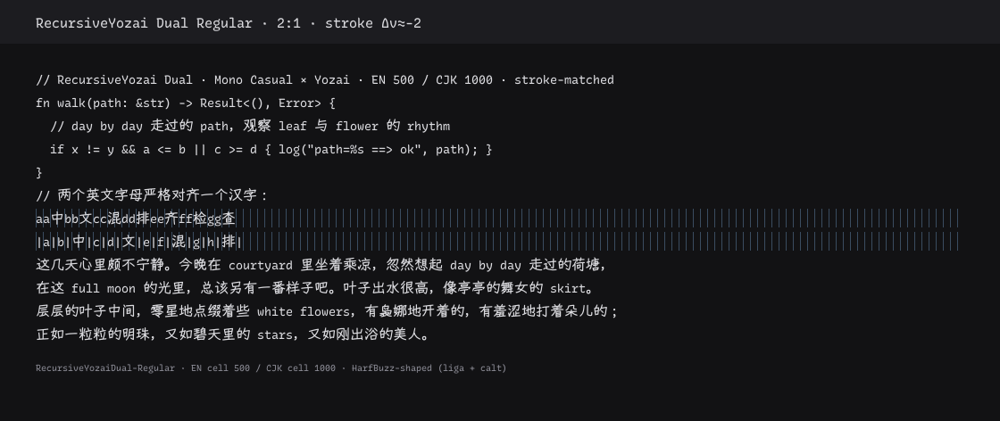

# casual — AKR Casual SC Dual

Casual coding dual-width face: **Recursive Mono Casual** Latin + **Yozai 悠哉** CJK,
strict **2:1** grid, **measured stroke match** (no Nerd patch in v0.1).



| Component | Source | Pin |
| --- | --- | --- |
| Latin | [Recursive](https://github.com/arrowtype/recursive) **Mono Casual** static | **v1.085** `RecursiveMonoCslSt` |
| CJK | [Yozai 悠哉](https://github.com/lxgw/yozai-font) | **v0.868** Regular + Medium |
| Grid | EN cell / CJK cell | **500 / 1000** (UPM 1000) |
| Weight match | measured vertical stems | Regular: Yozai Regular **+ s=10** · Bold: Medium **+ s=20** |
| Slant | — | **0°** (Recursive Casual is upright) |
| Product | Regular + Bold | `out/AKRCasualSCDual-{Regular,Bold}.ttf` |

```bash
just build casual
# → out/AKRCasualSCDual-{Regular,Bold}.ttf
```

## Why this pairing

Recursive **Casual** is the soft, slightly handwriting end of Recursive’s Casual↔Linear
axis. Yozai is a handwriting CJK face (YozFont derivative). Together they share a
relaxed “note / UI / prose-in-code” mood — distinct from:

| Folder | Mood |
| --- | --- |
| `serif/` | Slab + 新致宋 |
| `sans/` | Lilex + Plex Sans SC |
| `handwriting/` | Radon + 文楷 (sheared) |
| `rounded/` | Curly + 资源圆体 |
| **`casual/`** | **Recursive Casual + 悠哉** |

## What the build solves

### 1. 2:1 from a 600-unit mono cell

Recursive Mono Casual’s cell is **600/1000** em. Pair that naïvely with Yozai’s
native 1000-unit Han advance and you get **1.67:1**, not 2:1.

Recipe: **uniform scale × (500/600)** on the Latin face so every mono cell lands on
exactly **500**, then import Yozai at native **1000**. Gate: `just gate casual`
(`fontkit verify-2to1 --profile dense --expect-half 500`).

### 2. Stroke weight (measured, not guessed)

After Latin scale, scanline vertical-stem medians @ UPM 1000
(`./scripts/calibrate-stroke.sh`, sharing `handwriting` / `lib/fontkit`):

| Face | v-stem (approx) | Match |
| --- | ---: | --- |
| Recursive Mono Casual Regular @ 500 | **78** | target |
| Yozai Regular raw | 56 | too light |
| **Yozai Regular + embolden s=10** | **~76** | **Δv ≈ −2** |
| Recursive Mono Casual Bold @ 500 | **112** | target |
| Yozai Medium raw | 68 | too light |
| **Yozai Medium + embolden s=20** | **~108** | **Δv ≈ −4** |

Pins: `calibration.regular.embolden = 10`, `calibration.bold.embolden = 20` in [`font.toml`](font.toml).

### 3. No shear

Unlike Radon (measured ~7.5° lean), Recursive Casual statics are upright —
`CJK_SLANT_DEG=0`.

## Name recipe

`AKR <Style> <Region> <Variant>` — see the naming section of the root
[`README.md`](../README.md).

| Token | Meaning |
| --- | --- |
| **AKR** | this repository's house name |
| **Casual** | Recursive Mono Casual Latin × 悠哉 Yozai CJK |
| **SC** | Simplified Chinese CJK master |
| **Dual** | 2:1 dual-width coding face. Not `NFM`: casual is the one coding family with **no** Nerd patch step, and naming icons it does not carry would be a lie. |

- Family (name ID 1): `AKR Casual SC Dual` (18 chars, Windows ≤ 31)
- PostScript / file stem: `AKRCasualSCDual`
- Not an official ArrowType or LXGW face. Was `RecursiveYozai Dual` before KIT-282.

The family name carries no upstream reserved name — the OFL does not allow a
derivative to keep its donors' reserved names. Donors are credited in name ID 5
(version string) and name ID 10 (description). See
[`../docs/naming-migration.md`](../docs/naming-migration.md).

## Layout

```
casual/
  font.toml
  licenses/
    OFL-Recursive.txt
    OFL-Yozai.txt
  scripts/
    prepare_latin.py          # scale mono TTF 600→500  (the only build code left here)
    calibrate-stroke.sh       # diagnostic: re-measure embolden strengths
    render-sample.sh          # diagnostic: refresh samples/rendered/
  samples/
    coding-mixed.txt
    rendered/sample-{dark,light}.png
  work/   # gitignored
  out/    # gitignored products
  dist/   # gitignored release zips
```

CJK embolden uses [`fontkit.prepare_cjk`](../lib/fontkit/prepare_cjk.py)
and merge uses [`fontkit.merge`](../lib/fontkit/merge.py), configured by `[merge]` in `font.toml`
(both were reached by hardcoded path into `../handwriting/scripts/` until KIT-277)
(Latin base + CJK import policy). Stroke tools: [`../lib/fontkit/`](../lib/fontkit/).

## Dependencies

- `bash`, `curl`, `unzip`, `zip`
- Python 3.10+ via `uv` or `venv` → `fonttools`, `skia-pathops`
- Optional for sample PNGs: `Pillow`, `uharfbuzz`, `freetype-py`, `numpy`

## Build / package

```bash
cd casual
just build casual                 # full pipeline + 2:1 gate
just release casual coding sc # → dist/AKRCasualSCDual-0.1.0.zip
./scripts/render-sample.sh         # refresh samples/rendered/
./scripts/calibrate-stroke.sh      # re-measure embolden strengths
```

## Out of scope (v0.1)

- Nerd Font patch (unlike handwriting / rounded / sans)
- Recursive **Sans** Casual (proportional) product — Mono only for the 2:1 coding grid
- Ligature expansion beyond what Recursive already ships in GSUB

## License

Upstream OFL 1.1 copies live in [`licenses/`](licenses/). Derived product must
preserve copyright and OFL notices; do not use reserved upstream family names
as the public family name without a rename pass.
