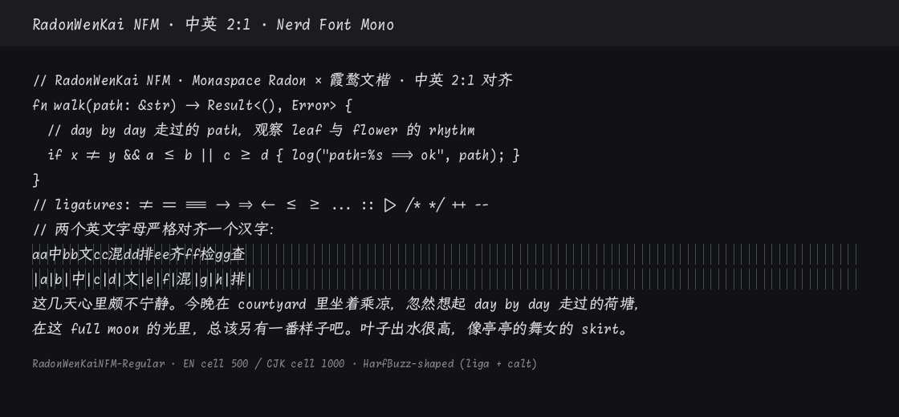

# handwriting — RadonWenKai NFM / RadonWenKai Text

**Monaspace Radon** Latin + **霞鹜文楷 LXGW WenKai** CJK, in two profiles that are two
different products:

- **RadonWenKai NFM** — the coding face. Strict **2:1** dual width, **Nerd icons**,
  ligatures **on by default**.
- **RadonWenKai Text** — the reading face (Phase 6, KIT-281). No 2:1 declaration, no
  Nerd icons, East_Asian_Width left alone, a typographic line box, and a **Light**.

Both share the CJK side sheared to Radon's own lean, and both share the optical stroke
matching that shear is calibrated with.



| Component | Source | Pin |
| --- | --- | --- |
| Latin / icons (coding) | [Monaspace Radon **NF**](https://github.com/githubnext/monaspace) (pre-patched Nerd build) | **v1.400** |
| Latin (text) | [Monaspace Radon](https://github.com/githubnext/monaspace) (plain static build, same release) | **v1.400** |
| CJK | [LXGW WenKai 霞鹜文楷](https://github.com/lxgw/LxgwWenKai) | **v1.522** |
| Grid | EN cell / CJK cell | **500 / 1000** (UPM 1000) |
| CJK slant | measured from Radon's stems | **7.5°** |
| Weight match | measured stems, Latin vs CJK | Light: WenKai **Regular** · Regular: **Medium** · Bold: Medium **+ s=15** — all unstroked except Bold |
| Ligatures | coding: `liga` + `calt` **+ ss01–ss10 folded into calt** · text: `liga`, sets stay opt-in | |
| Products | coding Regular + Bold · text Light + Regular + Bold | `out/RadonWenKaiNFM-{Regular,Bold}.ttf`, `out/RadonWenKaiText-{Light,Regular,Bold}.{ttf,woff2}` |

```bash
just build handwriting
# → out/RadonWenKaiNFM-{Regular,Bold}.ttf
#   out/RadonWenKaiText-{Light,Regular,Bold}.{ttf,woff2}
#   (~330 MiB of upstream never downloaded)
```

## Two profiles, and what actually differs

The judgement call in every row: does this constraint serve the **terminal cell** or does it
serve **reading**? The first kind is switched off for `text`; the second kind is shared.

| | coding | text |
| --- | --- | --- |
| strict 2:1 EN\:CJK | hard gate | not applicable |
| `post.isFixedPitch` / PANOSE mono | declared | **actively withdrawn** |
| East_Asian_Width forced onto cells | yes | no — … and — keep WenKai's full width |
| Nerd patch | yes (upstream NF donor) | no (plain donor) |
| ss01–ss10 folded into `calt` | yes | no |
| upstream hinting | dropped | kept |
| line box | terminal-tight (gap 0) | typographic (gap 200, 1.30 em) |
| **CJK↔Latin optical stroke match** | **yes** | **yes** |
| formats | `ttf` | `ttf` `woff2` |

Two of those are worth spelling out, because they are where a shared implementation would
have been wrong:

**`isFixedPitch` has to be cleared, not merely left alone.** Both donors are monospaced by
design, so the flag and PANOSE bProportion=9 arrive *set* from the Latin side. A text face
that inherited them would be listed by every "monospace only" font picker — macOS Core Text,
Chromium, VS Code — as a terminal font it is not. `fontkit.merge.declare_proportional` is the
mirror of `declare_strict_2to1` for exactly this reason.

**The two gates contradict each other on purpose.** U+2026 … is East_Asian_Width=Ambiguous.
A terminal gives Ambiguous one cell, so `verify-2to1` is satisfied by Radon's narrow ellipsis;
prose set by a CJK face wants the full-width 省略号, so `verify-text` fails that same advance.
Neither gate is a `--profile` flag on the other; a correct text product fails every assertion
the coding gate makes.

The candidate set for "take it from the CJK donor" is short and named — `·` `—` `‘` `’` `“` `”`
`…` — and membership is not enough. The merge asks the donor whether it drew the glyph for a
whole cell: LXGW WenKai draws … and — at 1000 but `‘ ’ “ ” ·` at **350**, as part of its own
proportional Latin. Importing that 350 would put WenKai's Latin quotes next to Radon's Latin
letters, which is worse than either font alone, so the merge declines them and keeps Radon's.

## Light

Only four of the seven families can take a Light at all; serif, typewriter and pixel say so
in their `font.toml` under `[[build.unsupported]]` rather than leaving a gap. handwriting can,
and the pairing was measured rather than assumed — the plan said Radon Light × WenKai **Light**
because both upstreams ship one, and the measurement disagreed:

| CJK candidate | v-stem | Δ vs Radon Light on the product grid (61.6) |
| --- | ---: | ---: |
| WenKai Light | 55.3 | −6.3 |
| **WenKai Regular** | 65.8 | **+4.2** |

`+4.2` is the same offset the Regular pairing already accepts (`+4.3`), and for the same
reason: Monaspace runs heavy for its nominal weight and WenKai runs light, so the CJK side is
taken one notch above the name — Light→Regular exactly as Regular→Medium. Light ships
unstroked; only Bold is emboldened, because WenKai has nothing above Medium.

Light is a **text-only** weight. A Light coding face is a legitimate product, but nobody has
calibrated one against a terminal, and `[[build.matrix]]` lists what is built rather than what
is possible.

## The four things this build actually had to solve

### 1. 2:1 on a font whose cell is 0.62 em

Monaspace draws a **1240/2000** em cell. Pair that with a 1 em Han glyph and you get a choice
between gappy CJK (ink filling 62 % of its two cells) or a brutal Latin squeeze. The recipe
here is the one [LXGW Bright Code](https://github.com/lxgw/LxgwBright-Code) uses for
Argon × WenKai: **x-narrow 1240 → 1111**, then scale the whole Latin face to **90 %**. The cell
lands on exactly 1000/2000 em = **0.5 em**, and WenKai is used at its native 1000 advance,
untouched horizontally.

Net Latin transform: `x × 0.4032`, `y × 0.45` into a 1000 UPM box → cap height 679, x-height 483,
Han ink ≈ 854 tall. CJK ink / Latin cap ≈ **1.26**, which is the comfortable band for mixed text.

### 2. Slant: Radon leans, and `italicAngle` lies

`post.italicAngle` is **0** for upright Radon — but it is a handwriting design and its stems
actually lean right. `scripts/measure-slant.py` regresses the ink-centre axis of the
straight-stem letters and reports the median:

| Face | I | H | T | k | E | **median** | round letters (o a d, excluded) |
| --- | ---: | ---: | ---: | ---: | ---: | ---: | --- |
| Radon Regular | 7.91° | 7.52° | 7.52° | 7.63° | 4.91° | **7.52°** | 23.7° / 23.5° / 25.4° |
| Radon Bold | 9.21° | 8.10° | 7.50° | 8.70° | 4.46° | **8.10°** | 24.0° / 21.9° / 26.2° |

Round and asymmetric letters read several degrees high (their widest point is not at
mid-height), so they are measured but not used. WenKai is sheared by the pinned
`CJK_SLANT_DEG=7.5` — one angle for the whole family, so mixed-weight text stays coherent —
about `y = 375` (≈ half the Han ink height) so glyphs stay centred in their cell instead of
drifting right at the top. For reference, Radon *Italic* measures ~18°, i.e. its declared
`-11°` on top of the 7.5° the upright already has.

### 3. Weight: Monaspace runs heavy, WenKai has no Bold

Stem widths are measured, not eyeballed — scanline vertical-stem medians at UPM 1000
(`scripts/calibrate_cjk_weight.py`, sharing `fontkit.measure`):

| CJK candidate | v-stem | Δ vs Radon Regular (73.3) | Δ vs Radon Bold (107.2) |
| --- | ---: | ---: | ---: |
| WenKai Light | 55.3 | −18.1 | −51.9 |
| WenKai Regular | 65.8 | −7.5 | −41.4 |
| **WenKai Medium** | 77.6 | **+4.3** | −29.6 |
| WenKai Medium + embolden s=15 | 107.7 | — | **+0.5** |

So **Radon Regular pairs with WenKai Medium**, not Regular — the same mapping LXGW Bright Code
documents. Regular ships **unstroked**: WenKai Regular + `s=4` would match verticals exactly
(+0.5) but leaves horizontals 9 units light and rounds off the brush entries and exits, and a
real design weight beats a stroked one. Bold has no choice — WenKai ships nothing heavier than
Medium — so it is emboldened to `s=15`.

Kai horizontals stay thinner than Latin by design (68–75 vs 78 in Regular); that contrast is the
typeface, not a defect. Verticals are what carry optical weight in mixed CN/EN mono text.

### 4. Ligatures that are actually on

Monaspace parks nearly every coding ligature in **stylistic sets**, not in `liga`/`calt` —
default `calt` does texture healing, and `liga` carries almost nothing. Editors that only flip
"font ligatures" (= `calt`) therefore show a Radon with ligatures apparently off. Probing each
set (shape a battery, diff the glyph run) gives:

| Set | Ligates |
| --- | --- |
| `ss01` | `=` family — `==` `===` `!=` `!==` |
| `ss02` | `<=` `>=` |
| `ss03` | arrows — `->` `<-` `<!--` |
| `ss04` | markup — `</>` |
| `ss05` | pipes — `\|>` |
| `ss06` | repeats — `+++` `###` `___` |
| `ss07` | `::` |
| `ss08` | raised-dot ranges — `..=` `..<` |
| `ss09` | `=>` |
| `ss10` | nothing in the probe battery (folded for completeness) |

`fontkit.expand_ligatures` unions those lookups into every `calt` feature record — the same
module that does the job for Iosevka's `dlig` in `serif/`, which is why it lives in
`lib/fontkit/` and not in either family. It runs at the tail of the `merged` step.
The `ss**` features stay intact for anyone toggling them individually.

The gate for this is a **shaping** test, not a tag check: `verify-features.py` runs HarfBuzz over
`== === != -> <- => <= >= :: |>` with only `liga`+`calt` on and fails if any sequence comes back
as its plain glyphs. Before the fold it scores 1/10; after, 10/10.

## Nerd icons

The product is a **Nerd Font Mono**: every icon sits on one cell. That comes for free from the
upstream `MonaspaceRadonNF-*` build, where all 12 697 glyphs — 2 320 PUA icons included — share
the single 1240 cell, so the same 0.4032 x-scale that makes ASCII 500 makes the icons 500. This
family has no `nerd` step at all: no patcher, no FontForge.

The 315 MiB `monaspace-nerdfonts-*.zip` is never downloaded: `tools/fetch_zip_member.py` reads
the zip's central directory with two ranged GETs and inflates just the two OTFs it needs
(~2.3 MiB each), checked against both the zip's CRC-32 and a pinned sha256. It runs inside a
fixed-output derivation (`nix/sources/`), so the ranged fetch happens once per pin for the whole
repo rather than once per build.

## Character policy

| Source | Role (coding) | Role (text) |
| --- | --- | --- |
| **Radon** (base font, kept whole) | ASCII, Latin, Greek/Cyrillic, programming symbols, box drawing, **Nerd icons**, **all layout tables** | the same, minus the icons — the text donor is the un-patched build |
| **WenKai** (imported, sheared) | Han, CJK punctuation, fullwidth forms, kana, bopomofo, every East_Asian_Width W/F codepoint, and anything Radon lacks | Han, CJK punctuation, fullwidth forms, kana, bopomofo — plus … and —, and **nothing** Radon already draws |

The text column is narrower on purpose. `cjk-side-or-missing`'s "or missing" clause exists to
fill terminal gaps; a reading face wants its Latin to be one design rather than a patchwork of
two, so nothing is taken merely because Radon lacks it.

Radon stays the **base** font, which is why `GSUB`/`GDEF` never has to be merged and the
ligatures survive at all. In the **coding** profile imported advances follow
**East_Asian_Width**, because that is what a terminal sizes cells by (it never asks the font): `W`/`F` → full cell, everything else → half
cell, with proportional fallbacks x-compressed to fit (1 121 glyphs). Glyphs WenKai already
draws for their cell keep their designed side bearings — no recentring, since CJK bearings are
deliberately asymmetric and sheared outlines are *meant* to overhang slightly.

Two subtleties the gate caught:

- WenKai maps several codepoints to one outline even when Unicode disagrees about their width
  (`U+205A ⁚` shares its glyph with a fullwidth colon). Such a glyph is **forked** per cell, or
  the last import silently wins the advance.
- 42 EAW-wide codepoints (`⚡ ⏩ 🕐 〈 〉 …`) exist only in Radon at one cell, while terminals
  give them two. Their advance moves to the full cell and the outline is centred — the same call
  `fontkit.narrow_symbol_widths` makes for this case.

## Layout

```
handwriting/
  font.toml                # sources, grid, slant, weight-match, naming, matrix
  licenses/                # OFL-Monaspace.txt · OFL-LXGWWenKai.txt (committed, not re-fetched)
  scripts/
    prepare_latin.py       # CFF→glyf, narrow+scale to the half cell
    verify-features.py     # feature + HarfBuzz shaping gate
    calibrate-stroke.sh    # diagnostic: stem survey + embolden sweep
  samples/coding-mixed.txt · samples/rendered/
  work/ out/ dist/         # gitignored
```

Shared rather than duplicated, from [`../lib/fontkit/`](../lib/fontkit/):
`fontkit.measure`, `fontkit.embolden`, `fontkit.verify2to1`, `fontkit.prepare_cjk`,
`fontkit.merge`, `fontkit.expand_ligatures`. The build itself is
[`../nix/families/handwriting.nix`](../nix/families/handwriting.nix), one derivation per step.

## Dependencies

Nix. Everything else — the interpreter, `fonttools`, `skia-pathops`, `uharfbuzz` — is a build
input of the steps that need it; see [`../nix/families/support.nix`](../nix/families/support.nix).
There is no FontForge and no Node in this family: the whole build is Python over two OFL fonts.

## Verify

```bash
just gate handwriting
# or individually:
python3 -m fontkit.verify2to1 --profile dense --check-nerd --check-eaw out/RadonWenKaiNFM-*.ttf
python3 scripts/verify-features.py --expect-half 500 out/RadonWenKaiNFM-*.ttf
```

| Check | Expected |
| --- | --- |
| ASCII / box drawing / halfwidth kana | 500 |
| Han / fullwidth / CJK punctuation | 1000 |
| every `EAW` `W`/`F` codepoint | 1000 |
| every `EAW` `N`/`Na`/`H` codepoint | 500 |
| Nerd / PUA icons (9 164 checked) | 500 |
| `post.isFixedPitch` / PANOSE `bProportion` | 1 / 9 (hosts' "is this mono?" flags) |
| `liga` `calt` `ccmp` `locl` + ss/cv sets | present |
| `== === != -> <- => <= >= :: \|>` under `liga`+`calt` only | all ligate (10/10) |

`--check-eaw` is the gate that matters for terminal alignment: a terminal sizes each cell from
Unicode's EAW table via `wcwidth()`, never from the font.

## Re-deriving the pins

```bash
./scripts/calibrate-stroke.sh
# → slant table (CJK_SLANT_DEG), weight survey (WENKAI_FOR_*), embolden sweep (CJK_EMBOLDEN_*)
```

Nothing in `font.toml` is a guess; every number above came out of that script. Change pins in a
dedicated commit with the new measurement in the message.

## Sample render

```bash
python3 scripts/render-sample.py --font out/RadonWenKaiNFM-Regular.ttf
# → samples/rendered/sample-{dark,light}.png
```

Pillow only shapes text when built with libraqm, which would render `!=` as two glyphs and make
a ligature font look broken in its own screenshot — so the sample shapes with HarfBuzz and
rasterises glyph outlines with FreeType.

## Release package

```bash
just release handwriting          # → dist/RadonWenKaiNFM-0.1.0.zip
nix build .#handwriting-text-release   # → dist/RadonWenKaiText-0.1.0.zip
```

Two profiles are two archives. They have different family names, different weight sets and
different formats, and someone downloading a reading face should not also get 4 000 Nerd icons.

## Family / license

- **Product families:** `RadonWenKai NFM` (Regular / Bold) and `RadonWenKai Text`
  (Light / Regular / Bold), PostScript `RadonWenKaiNFM-*` / `RadonWenKaiText-*`. Separate
  families on purpose — installed side by side under one name, a host would treat them as two
  styles of one family and pick either for "Bold".
- Upstream is **SIL OFL 1.1** on both sides; `licenses/` copies travel with the product
- ⚠ **Reserved font names.** Monaspace reserves `Monaspace` **and its subfamily names, including
  `Radon`**; WenKai reserves 霞鹜 / 霞鶩 / 落霞孤鹜 / 落霞孤鶩 / `LXGW` (the Latin "WenKai" is not
  listed). `RadonWenKai NFM` is a project source-encoding label in the same style as
  `LilexSansSC Dual` — fine for local use, but **rename before any public redistribution**.
  WenKai's OFL also carries an additional permission worth reading if you plan to ship this.
- Build scripts here: MIT (repo root) unless noted

## Known limits

1. WenKai's own `GSUB`/`GPOS` is not merged (no CJK `locl` / vertical forms; `vmtx`/`vhea` dropped)
2. No Italic face — Radon Italic (−11° on top of the intrinsic lean) is a future weight pair
3. No hinting: WenKai's `prep`/`gasp` are dropped with the outline transform and Radon NF ships none
4. Regular's CJK verticals run ~6 % heavier than the Latin's (real design weights land where they land)
5. `ss10`'s contents are unidentified — folded into `calt` on the assumption it is a ligature set
6. Ambiguous-width (`EAW=A`) codepoints are left at whatever the source gives; terminals let
   users choose 1 or 2 cells for those
7. **text profile:** no OTF. The products are quadratic by construction (cu2qu on the Latin
   side, TrueType CJK), so a CFF OTF would need a second lossy curve conversion of every
   imported Han glyph. Declared in `font.toml` under `[[build.unsupported]]`
8. **text profile:** Monaspace ships no `GPOS` at all — it is a monospaced design — so "keep the
   Latin donor's kerning" is vacuous here rather than achieved. `verify-text --require-gpos`
   exists for the families whose Latin donor does kern
9. No **coding** Light: possible, but not calibrated against a terminal
